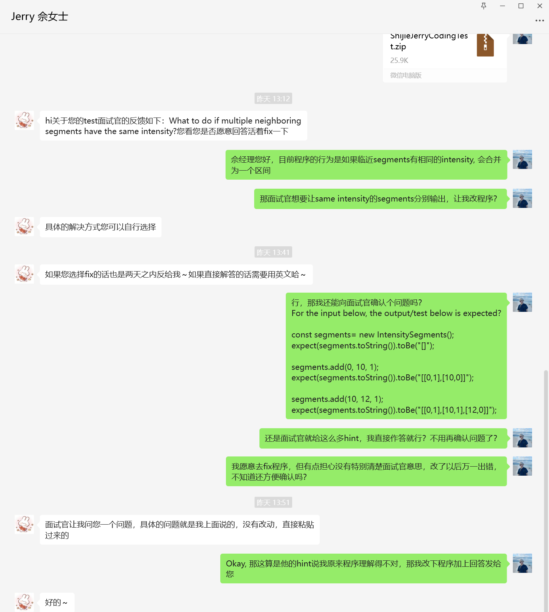

# ChangeLog
* For the feedback from interviewer "What if neighboring segments have the same value", implement the following changes:
  1. The main change happens inside the private method removeRedundantZeroesAtBeginEnd(). The original behavior for neighboring segments with same value is to unite them. Per the interviewer's ask, they should be output separately. 
    * When there are multiple segments with same values, all segments will be output separately. 
    * For beginning and trailing zeros, they will be trimmed as demonstrated in the PDF. 
    * For 0s in the middle, different segments will be output. 
  2. Restructure the two test suite (add() and set()) to following:
    * Add() operation for single existing interval
    * Add() operation involving multiple existing intervals. And this contains dedicated unit tests for neighboring elements with same values.
    * Set() operation for single existing interval
    * Set() operation involving multiple existing intervals. And this contains dedicated unit tests for neighboring elements with same values.

* In addition, implement the following changes for refactor purpose:
  1. Refactor the logic within handleTo() function for simplicity and fix minor edge case bugs. 
  2. Refactor the logic within toString() function for better performance. 

# Interaction with HR

