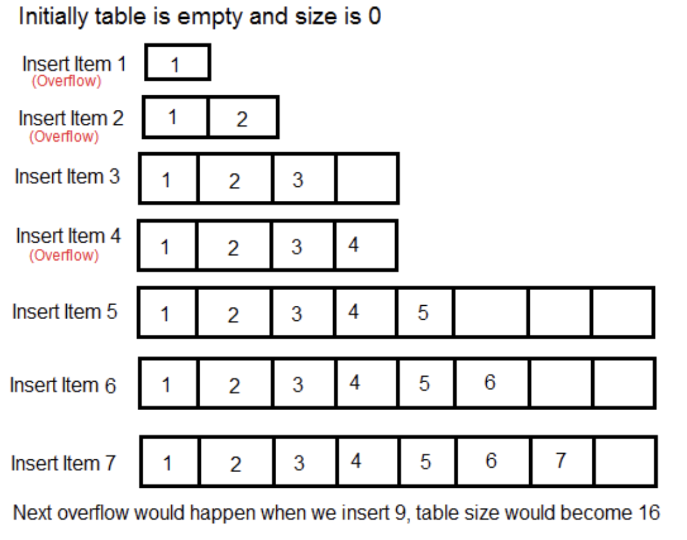

- [Time complexity analysis](#time-complexity-analysis)
  - [Amortized analysis](#amortized-analysis)
  - [List operations](#list-operations)
  - [Dictionary operations](#dictionary-operations)
  - [Set operations](#set-operations)
  - [Sorted container inner working](#sorted-container-inner-working)
    - [Compare with tree based impl](#compare-with-tree-based-impl)
  - [SortedList operations](#sortedlist-operations)
  - [SortedSet operations](#sortedset-operations)
  - [SortedDict operations](#sorteddict-operations)
  - [References](#references)

# Time complexity analysis
## Amortized analysis

* Amortized Analysis is used for algorithms where an occasional operation is very slow, but most of the other operations are faster.
* The example data structures whose operations are analyzed using Amortized Analysis are Hash Tables, Disjoint Sets and Splay Trees.
* The complexity analysis using worst case gives a loose upper bound. Amortized analysis gives a tighter upper bound. In Amortized Analysis, we analyze a sequence of operations and guarantee a worst case average time which is lower than the worst case time of a particular expensive operation.

## List operations
* Inner working: Python lists are internally represented as arrays. The idea used is similar to implementation of vectors in C++ or ArrayList in Java. The costly operations are inserting and deleting items near the beginning (as everything has to be moved). Insert at the end also becomes costly if preallocated space becomes full.

| Operation          | Examples       | Amortized complexity |
| ------------------ | -------------- | -------------------- |
| `Append`           | l.append(item) | O(1)                 |
| `Clear`            | l.clear()      | O(1)                 |
| `Contain item`     | in/not in l    | O(N)                 |
| `Copy`             | l.copy()       | O(N)                 |
| `Delete`           | del l\[i]      | O(N)                 |
| `Extend`           | l.extend(…)    | O(N)                 |
| `Equality`         | l1==l2, l1!=l2 | O(N)                 |
| `Index`            | l\[i]          | O(1)                 |
| `Iteration`        | for item in l: | O(N)                 |
| `Length`           | len(l)         | O(1)                 |
| `Multiply`         | k\*l           | O(k\*N)              |
| `Min, Max`         | min(l), max(l) | O(N)                 |
| `Pop from end`     | l.pop(-1)      | O(1)                 |
| `Pop intermediate` | l.pop(item)    | O(N)                 |
| `Reverse`          | l.reverse()    | O(N)                 |
| `Slice`            | l\[x:y]        | O(y-x)               |
| `Sort`             | l.sort()       | O(N\*log(N))         |
| `Store`            | l\[i]=item     | O(1)                 |

## Dictionary operations

| Operation          | Examples       | Amortized complexity |
| ----------------------------- | --------------- | ---------------------- |
| `Clear`                       | d.clear()       | O(1)                   |
| `Construction`                | dict(…)         | O(len(d))              |
| `Delete`                      | del d\[k]       | O(1)                   |
| `Get`                         | d.get()         | O(1)                   |
| `Iteration(key, value, item)` | for item in d:  | O(N)                   |
| `Length`                      | len(d)          | O(1)                   |
| `Pop`                         | d.pop(item)     | O(1)                   |
| `Pop Item`                    | d.popitem()     | O(1)                   |
| `Returning Views`             | d.keys()        | O(1)                   |
| `Fromkeys`                    | d.fromkeys(seq) | O(len(seq))            |

## Set operations
* Inner working: Set in Python can be defined as the collection of items. In Python, these are basically used to include membership testing and eliminating duplicate entries. The data structure used in this is Hashing, a popular technique to perform insertion, deletion and traversal in O(1) on average. The operations on Hash Table are some what similar to Linked List. Sets in python are unordered list with duplicate elements removed.

| Operation          | Examples       | Amortized complexity |
| ---------------------- | ------------------------ | ------------------------ |
| `Add`                  | s.add(item)              | O(1)                     |
| `Clear`                | s.clear()                | O(1)                     |
| `Copy`                 | s.copy()                 | O(N)                     |
| `Containment`          | item in/not in s         | O(1)                     |
| `Creation`             | set(…)                   | O(len(s))                |
| `Discard`              | s.discard(item)          | O(1)                     |
| `Difference`           | s1-s2                    | O(len(s1))               |
| `Difference Update`    | s1.difference_update(s2) | O(len(s2))               |
| `Equality`             | s1==s2, s1!=s2           | O(min(len(s1), len(s2))) |
| `Intersection`         | s1 & s2                  | O(min(len(s1), len(s2))) |
| `Iteration`            | for item in s:           | O(N)                     |
| `Is Subset`            | s1<=s2                   | O(len(s1))               |
| `Is Superset`          | s1>=s2                   | O(len(s2))               |
| `Pop`                  | s.pop()                  | O(1)                     |
| `Union`                | s1                       | s2                       |
| `Symmetric Difference` | s1^s2                    | len(s1)                  |

## Sorted container inner working
* Inner implementation: http://www.grantjenks.com/docs/sortedcontainers/implementation.html
* First impl intuition:
  *  The first is that Python’s list is fast, really fast. Lists have great characteristics for memory management and random access. 
  *  The second is that bisect.insort is fast. This is somewhat counter-intuitive since it involves shifting a series of items in a list
* Second impl intuition: But using only one list and bisect.insort would produce sluggish behavior for lengths exceeding ten thousand. So the implementation of Sorted List uses a list of lists to store elements. In this way, inserting or deleting is most often performed on a short list. Only rarely does a new list need to be added or deleted.

### Compare with tree based impl
* Traditional tree-based designs have better big-O notation but that ignores the realities of today’s software and hardware. For a more in-depth analysis, read Performance at Scale. Compared to tree-based implementations, using lists of lists has a few advantages based on memory usage. 
  1. Most insertion/deletion doesn’t require allocating or freeing memory. This can be a big win as it takes a lot of strain off the garbage collector and memory system.
  2. Pointers to elements are packed densely. A traditional tree-based implementation would require two pointers (left/right) to child nodes. Lists have no such overhead. This benefits the hardware’s memory architecture and more efficiently utilizies caches.
  3. The memory overhead per item is effectively a pointer to the item. Binary tree implementations must add at least two more pointers per item.
  4. Iteration is extremely fast as sequentially indexing lists is a strength of modern processors.

## SortedList operations
* http://www.grantjenks.com/docs/sortedcontainers/sortedlist.html

## SortedSet operations
* http://www.grantjenks.com/docs/sortedcontainers/sortedset.html

## SortedDict operations
* http://www.grantjenks.com/docs/sortedcontainers/sorteddict.html

## References
* [Python built-in container operations](https://www.geeksforgeeks.org/complexity-cheat-sheet-for-python-operations/)
* [Inter working of Python List](https://www.geeksforgeeks.org/internal-working-of-list-in-python/)